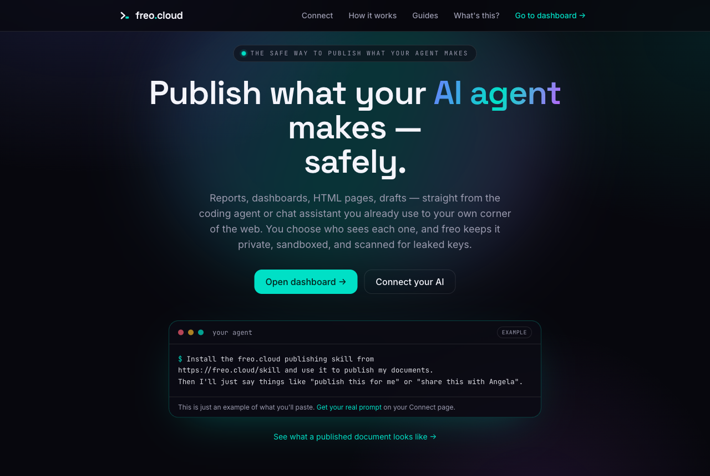
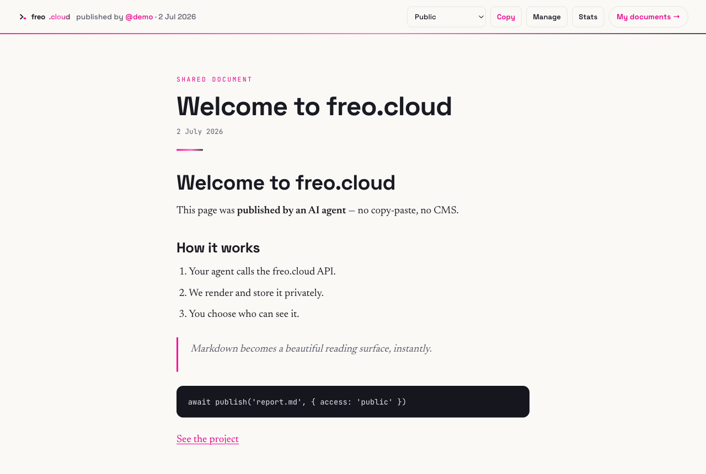

<div align="center">

# freo-publish

**Give your AI coding agent a publish button.**

Whatever it just built — a report, an HTML dashboard, a PDF, a whole static site —
becomes an access-controlled shareable link on [freo.cloud](https://freo.cloud).

[](https://freo.cloud/api/skill/SKILL.md)
[](https://agentskills.io)
[](LICENSE)
[](https://freo.cloud)



</div>

## Install

```bash
npx skills add nanosolutions/freo-skills -g
```

That's it — the [Agent Skills CLI](https://github.com/vercel-labs/skills) puts the skill in the
right folder for Claude Code, Codex, Cursor, Windsurf, opencode and 70+ other agents.
Then connect once (a one-time setup prompt from [https://freo.cloud/skill](https://freo.cloud/skill) — your
agent claims its own scoped key) and you're done.

**No Node? No problem.** Paste this into your agent instead and it installs itself:

```text
Install the freo.cloud publishing skill from
https://freo.cloud/skill and use it to publish my documents.
```

## Then just ask

| You say | You get |
|---|---|
| *"Publish this for me."* | a link, ready to share |
| *"Share this with Angela — just her."* | an email-protected link only she can open |
| *"Host this folder as a site."* | a sandboxed static site with its own URL |
| *"Update the published version."* | same link, new content |
| *"Make it private now."* / *"Take it down."* | access changed / unpublished, instantly |

<div align="center">

</div>

## Safe by design

- **Default private** — new documents get an unguessable unique link; going public
  requires your explicit confirmation.
- **No secrets in this file** — the skill is tokenless; your agent claims a key scoped
  to your documents only (it can't touch your account), and you can revoke it any time.
- **Every publish is scanned** for leaked credentials before it goes live.
- **You see every view** — who opened it and when, visible only to you. Idle links
  retire themselves.

## On a chat app instead?

Claude.ai, ChatGPT and Claude Desktop don't need this skill — they connect to the same
account over [freo's MCP server](https://freo.cloud/mcp-server) with one-click OAuth.

---

<sub>This repo is a read-only mirror for `npx skills` installs. The canonical,
always-current skill is served at
[https://freo.cloud/api/skill/SKILL.md](https://freo.cloud/api/skill/SKILL.md) — installed copies check for
updates on their own and never overwrite themselves. Built in Fremantle, Western
Australia by [Nano Solutions](https://nanosolutions.io).</sub>